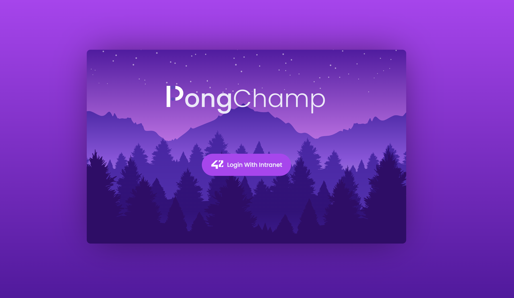
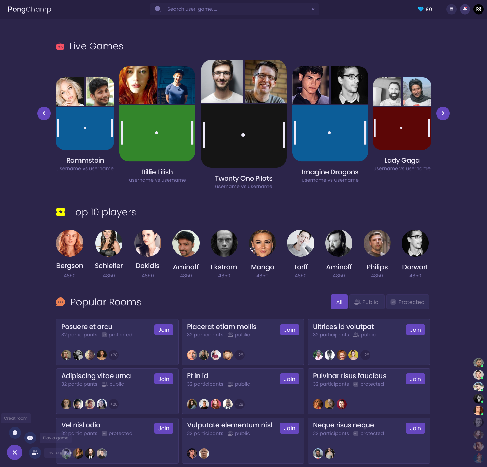
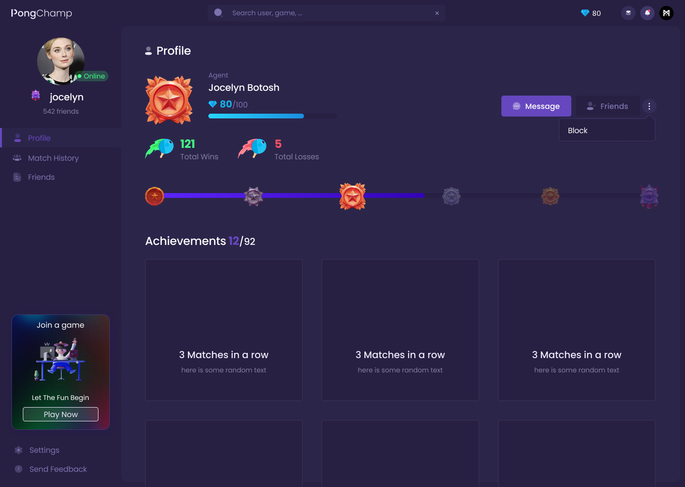
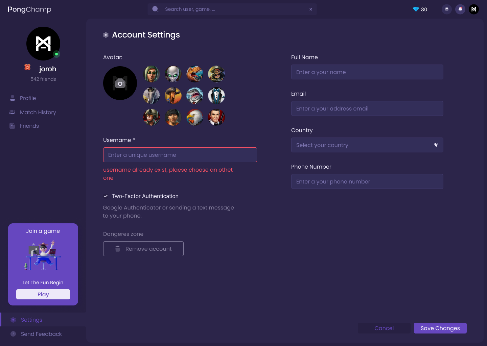
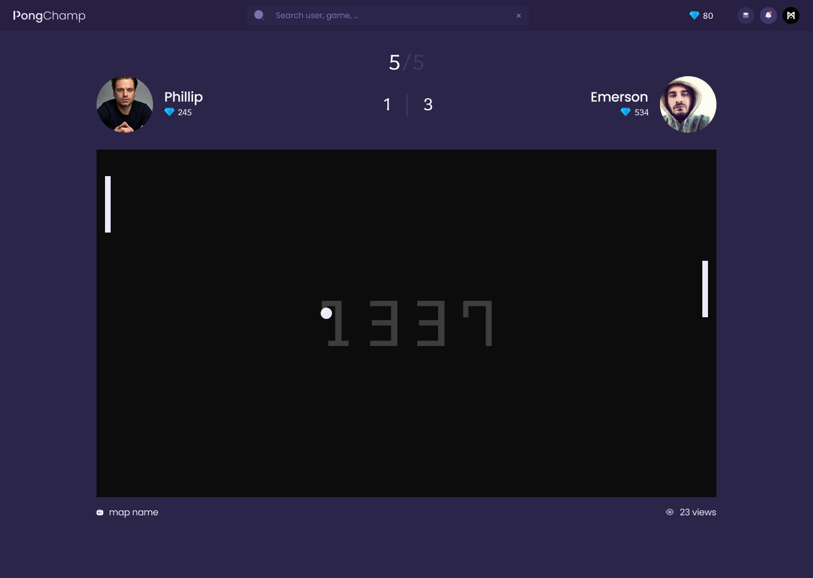
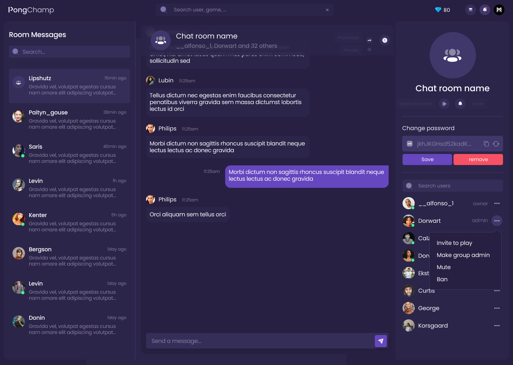

# ft_transcendence

    A website for chatting and playing pong matches against other users. Completed by @hfadyl, @0xJoroh , and @fsarbout .

## Key Features:

- Chat function with the ability to create public/private channels or channels protected by a password
- Direct messaging between users and the option to block other users
- User profiles visible through the chat interface
- Real-time multiplayer online pong games with a matchmaking system
- User accounts with OAuth integration, unique display names, avatar uploads, and two-factor authentication
- Ability to add other users as friends and view their current status
- Stats tracking, including victories, losses, and other stats

## Technical Requirements:

- TypeScript programming language
- NextJS frontend framework
- NestJS backend framework
- PostgreSQL database
- Docker-compose for application management

## Security Concerns:

- All passwords stored in the database must be encrypted
- The website must be protected against SQL injections
- Server-side validation must be implemented for forms and user input

## How to Test:

- Clone the repository and navigate to the project directory:

```
git clone https://github.com/hfadyl/Transcendence-.git
cd Transcendence-
```

-Do Not Forgot to add client Id and secret of your 42 app, and chnage your to your machine IP in .env

- Run the docker-compose command to start the application:

```
docker-compose up --build
```

## Screenshots














